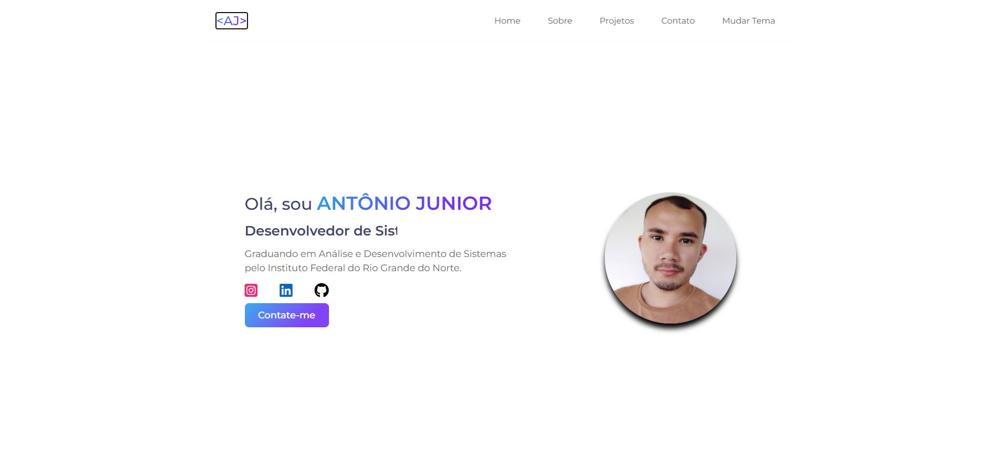
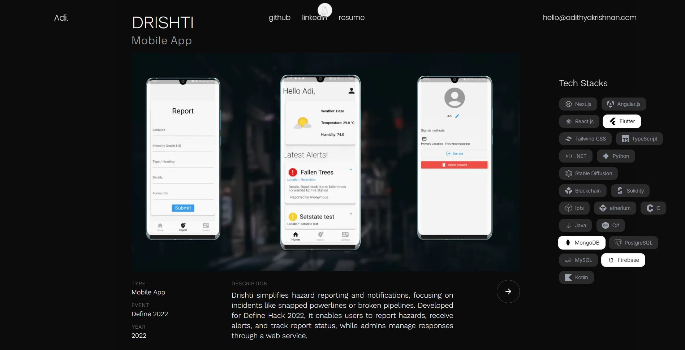
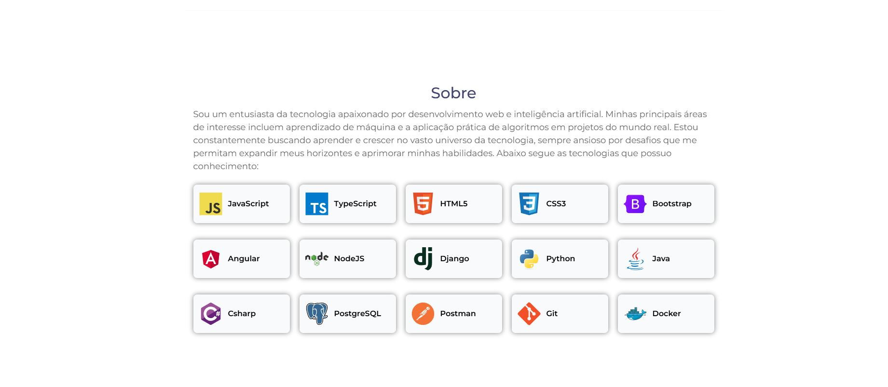
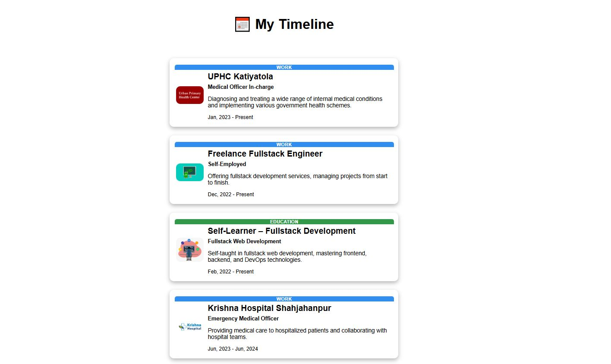
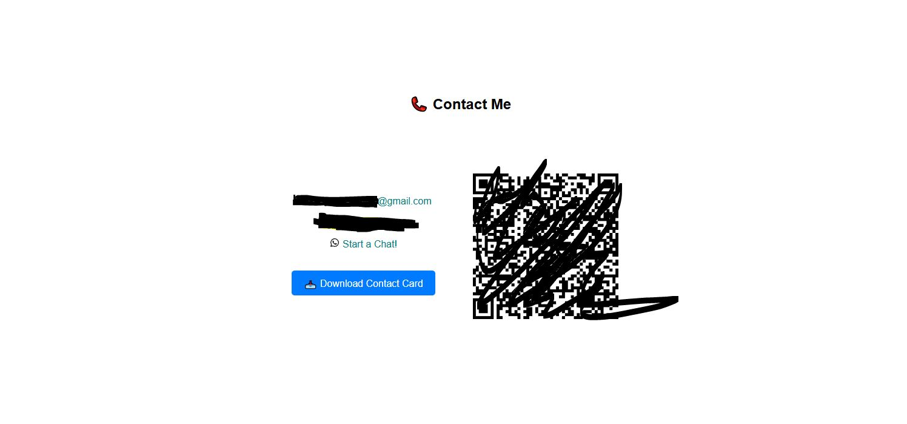

# Proyecto-personal-portfolio
Un proyecto Vue intentando hacer un portfolio personal

## Ideas de portfolios que uso de inspiración

### HOME
- Este home es muy sencillo pero eficaz a la hora de querer dar un pequeño esbozo sobre uno mismo

### PROYECTOS
- Esta es una página que muestra los proyectos en bloque uno tras otro y es muy intuitiva porque a la derecha se muestran las herramientas usadas para desarrollar tales proyectos, mostrando así también tus capacidades.

### HABILIDADES
- Esta página va al grano, muestra que tecnologías conoce el desarrollador cada una en una tarjeta clickable que te envía a la página principal de cada una de las tecnologías.

### EXPERIENCIA
- Esta página que muestrea la experiencia de una persona se muestra en forma de linea de tiempo, lo que lo hace muy intuitivo para que puedan ver a que te has dedicado, solo faltaría poner el botón para descargar el PDF que lo ideal sería ponerlo arriba por si alguién quiere ir a descargarlo rápidamente.

### CONTACTO
- Esta página de contacto tiene todo lo necesario(obviamente está censurado) para poder contactar con el desarrollador, pero lo que sería interesante para mi página sería cambiar el QR por un formulario por ejemplo, además de añadir algunas redes sociales.

